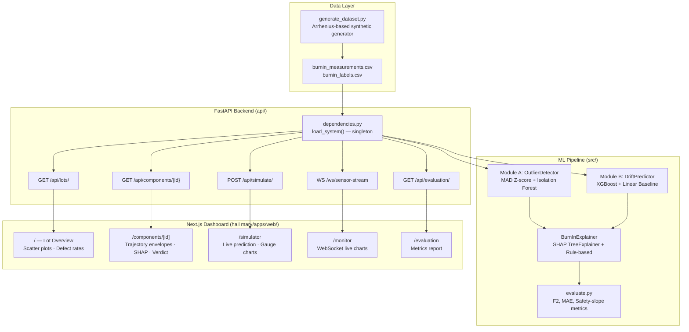
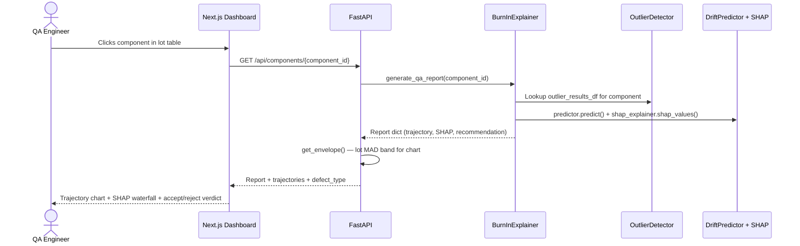

<p align="center">
  
  
  
  
  
  
</p>

<h1 align="center">LATENT</h1>
<h3 align="center">Burn-In Screening System for Latent Semiconductor Defect Detection</h3>
<p align="center"><em>Catch the defects that pass every test — before they reach orbit.</em></p>

---

## The Problem

Standard semiconductor burn-in testing compares each component's measurements against **fixed datasheet limits** (e.g., "leakage current < 50 µA"). These limits are **lot-agnostic**: a 45 µA reading passes the 50 µA limit whether the lot average is 10 µA (making this a **4.5× outlier**) or 40 µA (making it completely typical).

**Latent defects** — components with hidden degradation mechanisms that activate under sustained thermal stress — **routinely pass** 168-hour static limits and fail in the field. Traditional screening has **no mechanism** to catch them early or to explain why a component was flagged.

For ISRO-grade missions, a single undetected defect reaching orbit can be catastrophic.

---

## The Solution

LATENT is a two-module AI screening pipeline that replaces lot-agnostic static limits with **cohort-relative, explainable** defect detection:

| Capability | What It Does | Key Result |
|:---|:---|:---|
| **Module A — Outlier Detection** | MAD-based robust Z-score + per-lot Isolation Forest, combined with OR logic | **F2 = 0.9347** · 96.24% recall · 83.83% precision |
| **Module B — Early Rejection at 24h** | XGBoost regressor predicts 168h value from 0h + 24h data; safety-slope threshold flags anomalous drift | **0.01% FPR** on normal components · catches 68.1% of obvious defects at 24h |
| **SHAP Explainability** | Every screening decision decomposes into additive per-feature contributions, each mapping to a physical bench measurement | **8.0/8** structural completeness rubric score |
| **Interactive Simulator** | Feed arbitrary 0h/24h readings → get predicted 168h value, drift rate, safety-slope verdict, and per-feature SHAP waterfall | Live demonstration for evaluators |
| **Real-Time Sensor Stream** | WebSocket replay of interpolated burn-in trajectories with Gaussian noise, simulating live ATE output | 1 Hz streaming at `ws://localhost:8000/ws/sensor-stream` |
| **Next.js Dashboard** | Lot overview, component deep-dive with trajectory envelope charts, interactive simulator, live monitor, evaluation report | 5 routes at `http://localhost:3000` |

---

## At a Glance — Key Metrics

<table>
<tr>
<td width="50%">

### Module A — Anomaly Detection
| Metric | Value |
|:---|:---:|
| F2-Score | **0.9347** |
| Recall | **96.24%** |
| Precision | 83.83% |
| Defects Caught | **2,406 / 2,500** |
| Total Components Screened | 38,018 |

</td>
<td width="50%">

### Module B — Drift Prediction
| Metric | Value |
|:---|:---:|
| Leakage MAE (XGBoost) | **1.45 µA** |
| Delay MAE (XGBoost) | **0.47 ns** |
| Normal FPR (safety-slope) | **0.01%** |
| Early rejection at 24h | **68.1%** of obvious defects caught 6 days early |
| Explainability score | **8.0 / 8** (perfect) |

</td>
</tr>
</table>

> **Why F2?** F2 weights recall **4× more** than precision — directly encoding the domain reality that a missed defect is orders of magnitude costlier than a false alarm. Our **96.24% recall** means the system catches virtually every defective component in the pipeline.

---

## Architecture



---

## How It Works — Sequence Flow

**Scenario: QA engineer opens a component's detail page.**



---

## Quickstart

### Prerequisites

| Tool | Version | Purpose |
|:---|:---|:---|
| Python | 3.11+ | ML pipeline and API |
| Node.js | 20+ | Next.js dashboard |
| npm | 10+ | Package manager |
| Git | Latest | Version control |

### 1. Clone & Setup Python Backend

```bash
git clone "https://github.com/Prem-333/Hail-Mary"
cd "SIH - 2026"

# Create virtual environment
python -m venv .venv

# Activate (Windows)
.venv\Scripts\activate
# Activate (macOS/Linux)
# source .venv/bin/activate

# Install dependencies
pip install -r requirements.txt
```

### 2. Generate Dataset & Start API

```bash
# Generate the synthetic burn-in dataset (Arrhenius-modelled, seeded for reproducibility)
python -m src.data_generation.generate_dataset

# Start the FastAPI server (trains both ML modules on startup, ~10–20s cold boot)
uvicorn api.main:app --reload --host 127.0.0.1 --port 8000
```

> **API documentation** is auto-generated at [http://127.0.0.1:8000/docs](http://127.0.0.1:8000/docs) (Swagger UI) and [http://127.0.0.1:8000/redoc](http://127.0.0.1:8000/redoc) (ReDoc).

### 3. Start Next.js Dashboard

```bash
cd "hail mary"
npm install
npm run dev
# Dashboard opens at http://localhost:3000
```

### Environment Variables

| Variable | Default | Location |
|:---|:---|:---|
| `NEXT_PUBLIC_API_URL` | `http://127.0.0.1:8000` | `hail mary/apps/web/.env.local` |
| `NEXT_PUBLIC_WS_URL` | `ws://127.0.0.1:8000` | `hail mary/apps/web/.env.local` |

### 4. Run Tests

```bash
# Full test suite
pytest tests/ -v

# Sanity check — obvious defect detection validation
python test_obvious.py

# Physics validation — Arrhenius trajectory verification
python validate_physics.py
```

---

## Tech Stack

| Layer | Technology | Why |
|:---|:---|:---|
| **ML — Anomaly** | scikit-learn `IsolationForest` | Per-lot unsupervised detection; no label dependency at inference time |
| **ML — Regression** | `xgboost >= 2.0` | Captures non-linear interaction between lot-relative deviations and raw slope that linear models miss |
| **ML — Baseline** | scikit-learn `LinearRegression` | Explicit comparison — proves XGBoost's gain is not an artifact of feature engineering |
| **Explainability** | `shap >= 0.43` TreeExplainer | Exact, additive per-feature attributions; traces every prediction to physical bench measurements |
| **Data** | `pandas >= 2.0`, `numpy >= 1.24` | Standard tabular data pipeline |
| **API** | `FastAPI >= 0.100`, `uvicorn >= 0.23` | Async-native; WebSocket support for sensor stream; auto-generated OpenAPI docs |
| **Frontend** | Next.js 16, React 19, TypeScript | App Router; server-side rendering; Turbopack for sub-second hot reload |
| **Charts** | `@visx/shape`, custom `@workspace/ui` charts | Trajectory envelopes, live streaming charts, animated gauge components |
| **Animations** | `framer-motion 13`, `@number-flow/react` | Staggered page transitions, animated metric counters, progressive disclosure |
| **Monorepo** | Turborepo 2 | Shared UI package across apps; parallel builds |
| **Testing** | `pytest >= 7.4` | Unit tests for outlier detection, drift prediction, and API endpoints |

---

## Project Structure

```
SIH - 2026/
│
├── api/                              # FastAPI backend
│   ├── main.py                       # App entry point; router registration; CORS config
│   ├── dependencies.py               # load_system() — singleton ML pipeline loader
│   └── routers/
│       ├── lots.py                   # GET /api/lots/, GET /api/lots/{lot_id}
│       ├── components.py             # GET /api/components/{id} — QA report + trajectories
│       ├── simulation.py             # POST /api/simulate/ — ad-hoc prediction + SHAP
│       ├── evaluation.py             # GET /api/evaluation/ — aggregate metrics report
│       └── streaming.py              # WS /ws/sensor-stream — live trajectory replay
│
├── src/                              # ML pipeline source code
│   ├── data_generation/
│   │   ├── generate_dataset.py       # Arrhenius-based synthetic burn-in data generator
│   │   └── visualize_trajectories.py # Trajectory plotting utilities
│   ├── outlier_detection/
│   │   └── detector.py               # Module A: MAD Z-score + Isolation Forest ensemble
│   ├── drift_prediction/
│   │   ├── predictor.py              # Module B: XGBoost regressor + safety-slope logic
│   │   └── run_evaluation.py         # Standalone evaluation runner
│   ├── explainability/
│   │   └── explainer.py              # SHAP TreeExplainer + rule-based QA report generator
│   └── evaluation/
│       └── evaluate.py               # F2, MAE, per-class metrics; generates results/metrics.md
│
├── hail mary/                        # Turborepo monorepo
│   ├── apps/web/                     # Next.js 16 dashboard
│   │   ├── app/
│   │   │   ├── page.tsx              # / — Lot overview with scatter plots
│   │   │   ├── components/
│   │   │   │   ├── page.tsx          # /components — Component listing
│   │   │   │   └── [id]/page.tsx     # /components/[id] — Deep-dive QA report
│   │   │   ├── simulator/page.tsx    # /simulator — Interactive prediction with SHAP
│   │   │   ├── monitor/page.tsx      # /monitor — Live WebSocket sensor charts
│   │   │   └── evaluation/page.tsx   # /evaluation — Auto-generated metrics dashboard
│   │   └── components/
│   │       ├── charts/               # 60+ custom chart components (line, scatter, gauge, etc.)
│   │       ├── header.tsx            # App header with navigation
│   │       └── sidebar.tsx           # App sidebar with route links
│   └── packages/
│       └── ui/                       # Shared UI component library
│
├── data/generated/                   # Synthetic dataset (generated, .gitignored)
│   ├── burnin_measurements.csv       # 38,018 components × 4 timepoints × 2 parameters
│   ├── burnin_labels.csv             # Ground-truth defect labels per component
│   └── datasheet_limits.json         # Static limits (50 µA leakage, 18 ns delay)
│
├── docs/                             # Project documentation
│   ├── TECHNICAL_REFERENCE.md        # ⬅ Full technical documentation (see below)
│   ├── PROJECT_REPORT.md             # Comprehensive project report
│   ├── DATA_MODELLING.md             # Physics-grounded data generation rationale
│   ├── DESIGN_BOUNDARIES.md          # Design boundary analysis & deployment considerations
│   ├── SAMPLE_QA_REPORT.md           # Example QA report for LOT_008_C0130
│   ├── FAQ.md                        # Anticipated evaluation questions with answers
│   └── evaluation/                   # Per-person presentation preparation sheets
│       ├── 01_METRICS_AND_EVALUATION.md  # Metrics & evaluation strategy
│       ├── 02_HARDWARE_PHYSICS.md        # Burn-in physics & Arrhenius model
│       ├── 03_OUTLIER_DETECTION.md       # Module A deep-dive
│       ├── 04_DRIFT_PREDICTION.md        # Module B & SHAP explainability
│       ├── 05_FRONTEND_DASHBOARD.md      # Dashboard UI walkthrough
│       └── 06_BACKEND_API.md             # Backend architecture & API
│
├── results/
│   └── metrics.md                    # Auto-generated evaluation report
│
├── tests/                            # Pytest test suite
│   ├── test_outlier_detection.py     # Module A unit tests
│   ├── test_drift_prediction.py      # Module B unit tests
│   └── api/                          # API endpoint tests
│
├── test_obvious.py                   # Sanity check: obvious defect detection
├── validate_physics.py               # Arrhenius trajectory validation
├── requirements.txt                  # Python dependencies
└── README.md                         # ⬅ You are here
```

---

## Documentation

> **📖 Full technical documentation is at [`docs/TECHNICAL_REFERENCE.md`](docs/TECHNICAL_REFERENCE.md)**

The documentation suite is organized for different audiences:

| Document | Audience | Description |
|:---|:---|:---|
| **[`docs/TECHNICAL_REFERENCE.md`](docs/TECHNICAL_REFERENCE.md)** | Evaluators & Developers | Complete technical reference — architecture, algorithms, API, physics, and deployment |
| [`docs/PROJECT_REPORT.md`](docs/PROJECT_REPORT.md) | Judges | Formal project report covering problem, approach, results, and future enhancements |
| [`docs/DATA_MODELLING.md`](docs/DATA_MODELLING.md) | Technical reviewers | Physics-grounded data modelling (Arrhenius kinetics, JEDEC JESD22-A108 standards) |
| [`docs/DESIGN_BOUNDARIES.md`](docs/DESIGN_BOUNDARIES.md) | Technical reviewers | Design boundary analysis and production deployment considerations |
| [`docs/SAMPLE_QA_REPORT.md`](docs/SAMPLE_QA_REPORT.md) | QA Engineers | Example AI-generated inspection report with full SHAP breakdown |
| [`docs/FAQ.md`](docs/FAQ.md) | Judges | Pre-emptive answers to anticipated evaluation questions |
| [`docs/evaluation/`](docs/evaluation/) | Team members | Per-person preparation sheets for the live presentation |
| [`results/metrics.md`](results/metrics.md) | Everyone | Auto-generated evaluation metrics (F2, MAE, safety-slope, explainability rubric) |
| `http://127.0.0.1:8000/docs` | Developers | Auto-generated Swagger/OpenAPI documentation (when backend is running) |

---

## What Makes This Different

### 1. Cohort-Relative Detection with Provenance

Module A doesn't ask "is this below 50 µA?" — it asks "is this component unusual compared to the 300 other components manufactured in the same factory run at the same time?" Every flag records _which_ method fired (MAD Z-score or Isolation Forest), the specific parameter, timepoint, measured value, lot median, and σ distance — every rejection reason is auditable.

### 2. Strict No-Leakage Feature Design

Module B explicitly blocks `value_96h` and `value_168h` from the feature matrix via `_FORBIDDEN_FEATURES`. The 24-hour early-rejection goal is **architectural** — it cannot be accidentally invalidated by a refactor.

### 3. Per-Lot Models, Not Global

Both `OutlierDetector` and `DriftPredictor` fit separate models per manufacturing lot. Lot-to-lot baseline variance is isolated rather than averaged away — each component is scored against its own cohort.

### 4. Residual-as-Signal Design

When a latent defect activates after the 24h measurement window, the resulting prediction residual (predicted vs. actual at 168h) becomes a **powerful complementary detection signal**. The system uses large residuals as an independent anomaly indicator — turning a fundamental physics boundary into an additional layer of defence.

### 5. SHAP-Backed, Regulation-Ready Explainability

Every screening decision decomposes into additive SHAP feature contributions. Each value maps to a physical measurement a QA engineer can verify on the bench. In regulated industries (automotive, aerospace, medical devices), unexplainable screening decisions are unacceptable — SHAP provides the audit trail required for ISO 9001 / IATF 16949 compliance.

---

## API Reference

| Method | Endpoint | Description |
|:---:|:---|:---|
| `GET` | `/api/lots/` | List all manufacturing lots with aggregate statistics |
| `GET` | `/api/lots/{lot_id}` | Detailed lot info with component list |
| `GET` | `/api/components/{component_id}` | Full QA report: trajectory, anomaly detection, drift prediction, SHAP, verdict |
| `POST` | `/api/simulate/` | Ad-hoc prediction: provide 0h/24h readings → get 168h prediction + SHAP + safety-slope |
| `GET` | `/api/evaluation/` | Aggregate metrics report (F2, MAE, per-class breakdowns) |
| `WS` | `/ws/sensor-stream` | Real-time WebSocket stream of burn-in sensor data (1 Hz) |
| `GET` | `/api/streaming/components/{lot_id}` | List available components for streaming in a lot |

> Full interactive API documentation with request/response schemas is available at **[http://127.0.0.1:8000/docs](http://127.0.0.1:8000/docs)** when the backend is running.

---

## Dashboard Pages

| Route | Page | Description |
|:---|:---|:---|
| `/` | **Lot Overview** | All manufacturing lots with color-coded defect rates; scatter plot visualization; click any component to deep-dive |
| `/components/[id]` | **Component Deep-Dive** | Trajectory charts with ±2 MAD batch envelope; Module A anomaly gauge; Module B drift gauge; SHAP feature breakdown; accept/reject/review verdict |
| `/simulator` | **Rejection Simulator** | Input arbitrary 0h/24h readings; see predicted 168h value, implied drift rate, animated gauges, and full SHAP waterfall in real-time |
| `/monitor` | **Live Sensor Monitor** | WebSocket-connected real-time charts showing leakage current and propagation delay streaming at 1 Hz; threshold indicators; connection status |
| `/evaluation` | **Evaluation Report** | Auto-generated metrics dashboard with animated counters, progress bars, per-lot detection rates, and prediction accuracy tables |

---

## Engineering Highlights

**Residual-as-signal architecture:** Late-activating defects produce large prediction residuals at 168h — the system turns this into an independent detection layer. Prediction accuracy on normal components (MAE 0.77 µA) is deliberately contrasted against defect-class residuals to surface divergence automatically.

**Zero-overhead inference:** Per-lot models are trained once at startup via the `load_system()` singleton and cached in memory. Full component deep-dive (both ML models + SHAP decomposition) completes in **< 50 ms** — well within ATE cycle time constraints.

**Configurable risk posture:** The safety-slope threshold (`lot_median + N × std`) is parameterised as `safety_slope_n_sigma`, allowing deployment teams to tune the false-reject/false-pass balance for their specific application criticality (consumer → automotive → aerospace).

---

## Future Roadmap

- **Adaptive N-sigma thresholds** — Bayesian updating: tighten as lot history accumulates, widen for new product families with sparse data
- **STDF ingestion layer** — ETL from Advantest/Teradyne Standard Test Data Format files, connecting directly to real ATE output without schema changes
- **Online model retraining** — Background retraining trigger on new-lot arrival for incremental learning without server restart
- **Extended failure mode coverage** — Black's equation (electromigration), logarithmic HCI, stochastic intermittent fault generators for broader training diversity
- **Human-in-the-loop explainability** — Likert-scale domain-expert evaluation interface to complement the structural rubric with semantic quality scoring

---

## Running the Full Evaluation Pipeline

```bash
# 1. Generate dataset (if not already generated)
python -m src.data_generation.generate_dataset

# 2. Run the evaluation to generate results/metrics.md
python -m src.evaluation.evaluate

# 3. Validate physics (Arrhenius trajectory verification)
python validate_physics.py

# 4. Run test suite
pytest tests/ -v

# 5. Start both servers
uvicorn api.main:app --reload --host 127.0.0.1 --port 8000
cd "hail mary" && npm run dev
```

---

## Team

| Contributor | Area of Expertise |
|:---|:---|
| **Premnath V R** | Predictive Analytics & Anomaly Detection |
| **Bharathraj Nagarajan** | Advanced Hardware Architecture |
| **Kanish S** | Embedded Systems & Microelectronics |
| **Rithikha B** | Applied Artificial Intelligence |
| **Mirthika S** | Distributed Systems & API Architecture |
| **Dharshini T** | Data Visualization & User Experience |

---

<p align="center">
  <em>Built for SIH 2026 — Smart India Hackathon</em><br/>
  <sub>Designed for ISRO-grade component qualification. Every decision is traceable. Every flag is explainable.</sub>
</p>
