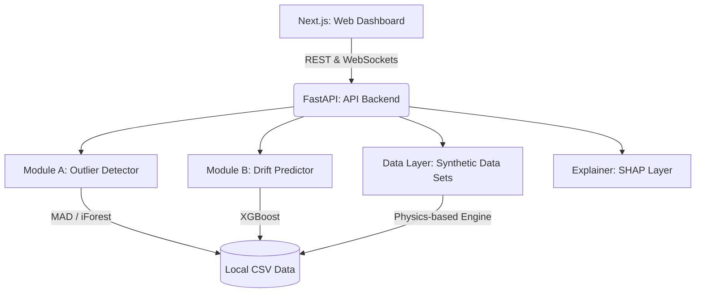
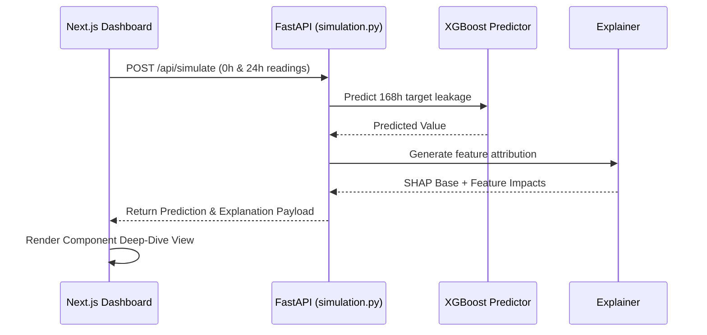

# LATENT

Provides cohort-relative anomaly detection and drift prediction to identify latent defects in semiconductor components during burn-in testing.


<!-- TODO: screenshot or 60s demo GIF here -->

## The Problem

Standard semiconductor component screening relies on static datasheet limits, where a component passes if its leakage stays below an absolute threshold (e.g., 50 µA). However, if every other component in a production lot measures 10 µA, a 48 µA part is a latent defect that will pass screening but likely fail in deployment (such as in a satellite). Static limits are blind to batch context, resulting in escaped defects.

## The Solution

- **Cohort-Relative Anomaly Detection**: Calculates Z-scores using Median Absolute Deviation (MAD) and an Isolation Forest ensemble to flag lot-relative outliers rather than absolute limits (`src/outlier_detection/detector.py`).
- **Early Rejection Prediction**: Predicts 168-hour end-of-test drift using only 0-hour and 24-hour readings via an XGBoost regressor, allowing faulty parts to be rejected days early (`src/drift_prediction/predictor.py`).
- **Explainable Decisions**: Decomposes all anomaly flags into human-readable feature impacts using SHAP values (`src/explainability/explainer.py`).
- **Live Sensor Streaming**: Visualizes live 1Hz component telemetry via WebSockets on a real-time monitor dashboard (`api/routers/streaming.py` and `hail mary/apps/web/app/monitor/page.tsx`).

## Architecture Diagram



## How It Works



## Tech Stack

| Layer | Technology | Why |
|-------|------------|-----|
| **Frontend UI** | Next.js 16.2 / React 19 | Server-side rendering, fast Turbopack compilation |
| **Charting & Viz** | Recharts / D3 | Complex scatter plots for lot overviews and trajectory lines |
| **Backend API** | FastAPI / Uvicorn | High-performance async REST endpoints and WebSocket streaming |
| **ML Models** | XGBoost / Scikit-Learn | Fast inference for drift regression and Isolation Forest detection |
| **Explainability** | SHAP | Provides additive, theoretically sound feature attributions for QA reports |

## What Makes This Different

- **MAD over Standard Deviation**: Uses Median Absolute Deviation for cohort stats (`detector.py`)—standard deviation is heavily skewed by the exact extreme outliers we are trying to catch, whereas MAD provides a robust baseline.
- **Safety-Slope Rejection**: Predicts final drift using XGBoost, but applies a custom per-lot statistical "safety slope" derived from early readings, catching latent defects reliably at 24 hours.

## Quickstart

**Prerequisites:** Python 3.11+, Node.js 20+

1. **Setup Backend & Generate Data:**
   ```bash
   python -m venv .venv
   source .venv/bin/activate  # On Windows use: .venv\Scripts\activate
   pip install -r requirements.txt
   
   # Generate synthetic dataset
   python -m src.data_generation.generate_dataset --lots 50
   
   # Start FastAPI server
   cd api
   uvicorn main:app --reload --port 8000
   ```

2. **Setup Frontend Dashboard:**
   ```bash
   cd "hail mary"
   npm install
   npm run dev
   ```
   > Access the dashboard at `http://localhost:3000`

<details>
<summary><b>Project Structure</b></summary>

```text
├── api/                # FastAPI backend routers and ML model bindings
├── hail mary/          # Next.js 16.2 turborepo frontend workspace
├── src/                # Core ML logic (detection, prediction, SHAP)
├── tests/              # Python test suite
├── notebooks/          # Jupyter exploratory notebooks
├── data/               # Local CSV dataset storage (generated)
└── results/            # Markdown evaluation reports
```
</details>

## Challenges & What We Learned

Tuning the XGBoost drift predictor required a counterintuitive approach to residual errors. Initially, we treated high prediction errors as model failures. However, we realized that latent defects are inherently unpredictable based solely on 0h/24h behavior. We leaned into this by using the prediction residual itself (the MAE gap between normal and latent parts) as a strong secondary signal for anomaly detection, rather than trying to perfectly predict random walks.

## What's Next

- **Physical Sensor Integration**: Swap the synthetic WebSocket data pump with a real hardware MQTT stream.
- **Dynamic Threshold Tuning**: Add an interactive UI slider to let QA engineers adjust the Z-score anomaly sensitivity on the fly.
- **PDF QA Reports**: Implement a route to export the component deep-dive view (including SHAP explanations) into a printable QA sign-off document.

<!-- TODO: add team members -->