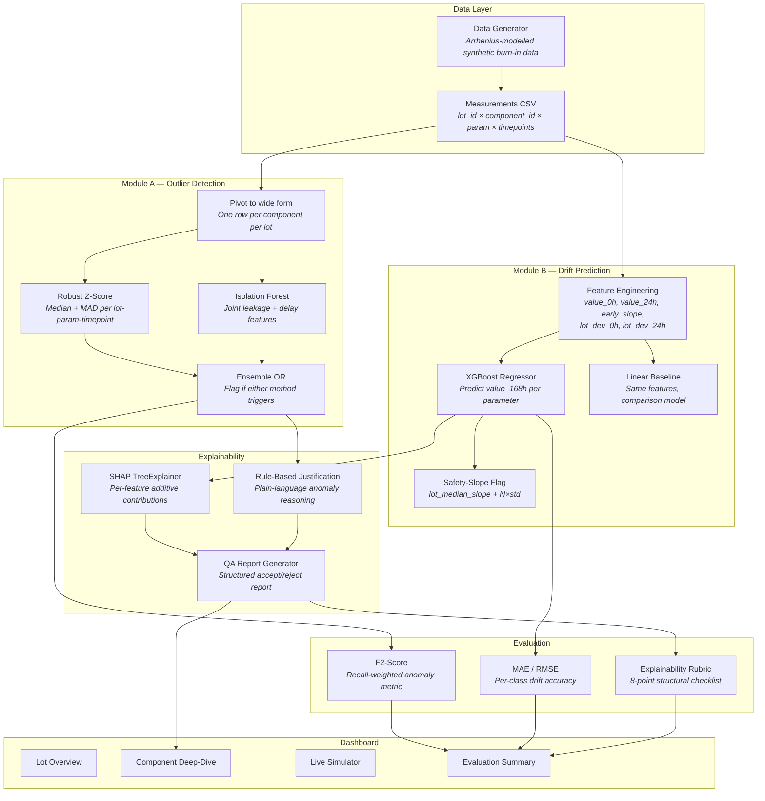

# Burn-In Screening System

**Cohort-relative anomaly detection and drift prediction for semiconductor
burn-in testing.**

## Problem Statement

Semiconductor components undergo burn-in testing — sustained thermal and
electrical stress (typically 125°C for 168 hours) — to precipitate latent
manufacturing defects before field deployment.  Parametric measurements
(leakage current, propagation delay) are sampled at intervals (0h, 24h,
96h, 168h) and compared against static datasheet limits.

The limitation of static limits is that they treat every component
identically.  A component reading 45 µA in a lot whose median is 10 µA
is exhibiting a 4.5× deviation that strongly indicates a latent defect —
yet it passes a 50 µA datasheet limit.  This system replaces static
screening with **cohort-relative** analysis: each component is evaluated
against its manufacturing lot's statistical baseline, not a fixed number.

The system also addresses a second gap: **early rejection**.  If a
component's 0h and 24h trajectory already implies dangerous 168h drift,
it can be flagged at 24h — cutting burn-in time by 85% for obvious
rejects.

## Architecture



## Results at a Glance

### Anomaly Detection (Module A)

| Metric | Value |
|--------|:-----:|
| **F2-Score** | **0.9311** |
| Recall | 95.58% |
| Precision | 84.40% |
| False Negatives | 11 / 249 defects |
| False Positive Rate | 1.3% |

F2 (not F1) is used because the problem brief states that a false negative
— shipping a defective component — is catastrophic.  F2 weights recall 4×
more than precision.

### Drift Prediction (Module B)

| Parameter | XGBoost MAE | Linear MAE | Latent MAE (XGB) |
|-----------|:-----------:|:----------:|:----------------:|
| Leakage Current (µA) | 1.36 | 1.59 | 10.67 |
| Propagation Delay (ns) | 0.42 | 0.50 | 3.19 |

Latent-class MAE is 14× higher than normal-class MAE.  This is expected:
the model learns normal drift patterns and cannot predict the unpredictable
divergence of latent defects — the high residual is itself a detection
signal.

### Safety-Slope Early Rejection

| Component Class | Flagged | Flag Rate |
|-----------------|:-------:|:---------:|
| Normal | 2 / 3310 | 0.1% |
| Latent | 74 / 198 | 37.4% |
| Obvious | 32 / 51 | 62.7% |

### Explainability

Average rubric score: **8.0 / 8** (10/10 sampled reports achieved perfect
structural completeness).

## Setup

### Prerequisites

- Python 3.11+
- pip

### Installation

```bash
# Clone the repository
git clone <repo-url>
cd burnin-screening

# Create virtual environment
python -m venv .venv

# Activate
# Windows:
.venv\Scripts\activate
# macOS/Linux:
source .venv/bin/activate

# Install dependencies
pip install -r requirements.txt
```

### Generate Data

```bash
python -m src.data_generation.generate_dataset
```

This creates `data/generated/burnin_measurements.csv` and
`data/generated/burnin_labels.csv` with ~3,500 components across 10 lots.

### Run Tests

```bash
python -m pytest tests/ -v
```

All 36 tests should pass.

### Run Evaluation

```bash
python -m src.evaluation.evaluate
```

Outputs `results/metrics.md` with full metrics breakdown.

### Launch Dashboard

```bash
streamlit run dashboard/app.py
```

Opens at `http://localhost:8501` with four views: Lot Overview, Component
Deep-Dive, Live Early-Rejection Simulator, and Evaluation Summary.

## Project Structure

```
burnin-screening/
├── dashboard/app.py              # Streamlit dashboard (4 views)
├── data/
│   ├── raw/                      # Placeholder for real fab data
│   └── generated/                # Synthetic burn-in data + trained models
├── src/
│   ├── data_generation/          # Arrhenius-modelled dataset generator
│   ├── outlier_detection/        # Module A: robust z-score + Isolation Forest
│   ├── drift_prediction/         # Module B: XGBoost + linear baseline
│   ├── explainability/           # SHAP + rule-based QA report generator
│   └── evaluation/               # F2-score, MAE/RMSE, explainability rubric
├── tests/                        # 36 unit tests (Module A + B)
├── docs/                         # Rationale, limitations, sample QA report
├── results/metrics.md            # Auto-generated evaluation report
├── requirements.txt
└── README.md
```

## Documentation

- [Project Report](docs/project_report.md) — full technical report
- [Known Limitations](docs/known_limitations.md) — honest constraints
- [Judge FAQ](docs/judge_faq.md) — anticipated evaluation questions
- [Sample QA Report](docs/sample_qa_report.md) — example for a flagged
  latent defect
- [Data Generation Rationale](docs/data_generation_rationale.md) — physics
  behind the synthetic data model
