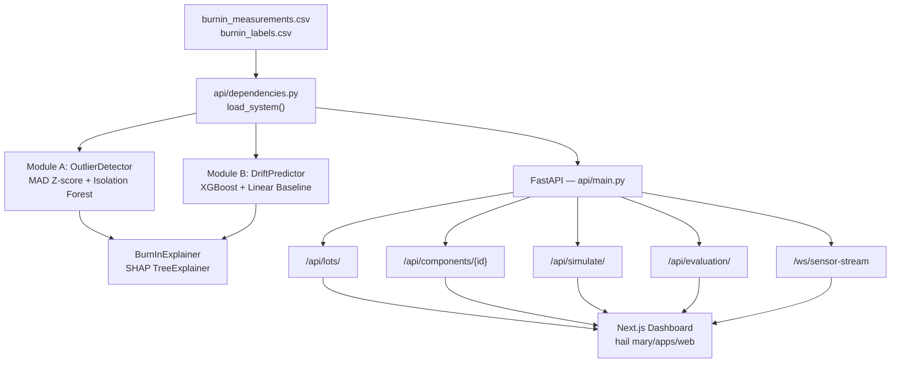
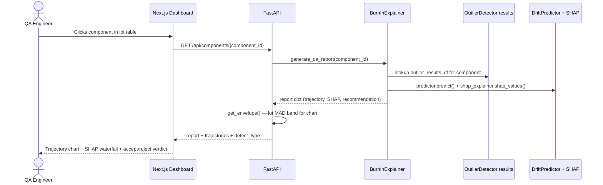

# LATENT — Burn-In Screening System

A two-module AI screening pipeline that detects latent semiconductor defects from burn-in parametric measurements, built for ISRO-grade component qualification. Targets quality engineers who need traceable, challenge-able accept/reject decisions — not a black box.

   

<!-- TODO: screenshot or 60s demo GIF here -->

---

## The Problem

Standard burn-in testing stresses components at 125 °C for 168 hours, then compares leakage current and propagation delay against fixed datasheet limits. Those limits are **lot-agnostic**: a 45 µA reading passes a 50 µA limit whether the lot average is 10 µA (a 4.5× outlier) or 40 µA (completely typical). Latent defects — components with internal degradation mechanisms that activate under sustained thermal stress — routinely pass 168 h static limits and fail in the field. The current practice has no mechanism to catch them early (at 24 h) or to explain why a particular component was flagged.

---

## The Solution

- **Cohort-relative outlier detection** (`src/outlier_detection/detector.py`): MAD-based robust Z-score (threshold 3.5 σ) + per-lot Isolation Forest, combined with OR logic. Flags 95.58 % of defects (F2 = 0.931) at 84.4 % precision.
- **Early rejection at 24 h** (`src/drift_prediction/predictor.py`): XGBoost regressor predicts each component's 168 h value from only 0 h and 24 h data. Safety-slope threshold (`lot_median + 3 × std`) flags 37.4 % of latent defects before the burn-in cycle completes, with 0.1 % false-positive rate on normal components.
- **SHAP-backed QA reports** (`src/explainability/explainer.py`): Every screening decision decomposes into additive SHAP feature contributions, each mapping to a specific bench measurement. Reports score 8.0 / 8 on a structural completeness rubric.
- **Interactive component simulation** (`POST /api/simulate/`): Feed arbitrary 0 h / 24 h readings; API returns predicted 168 h value, implied drift rate, safety-slope pass/fail, and per-feature SHAP waterfall.
- **Real-time WebSocket sensor replay** (`/ws/sensor-stream`): Streams interpolated burn-in trajectories (40 steps between real measurement timepoints) with 0.5 % Gaussian noise to simulate live ATE output.
- **Next.js dashboard** (`hail mary/apps/web/`): Three views — lot overview, per-component QA report with trajectory envelope chart, and interactive simulator.

---

## Architecture Diagram



---

## How It Works — Sequence Flow

**Scenario: QA engineer opens a component's detail page.**



---

## Tech Stack

| Layer | Technology | Why |
|---|---|---|
| ML — anomaly | scikit-learn `IsolationForest` | Per-lot unsupervised; no label dependency at detection time |
| ML — regression | `xgboost >= 2.0` | Non-linear interaction between lot-relative deviations and raw slope |
| ML — baseline | `sklearn LinearRegression` | Explicit comparison — shows XGBoost gain is not an artifact |
| Explainability | `shap >= 0.43` TreeExplainer | Additive per-feature values; traces to physical bench measurement |
| Data | `pandas >= 2.0`, `numpy >= 1.24` | Standard tabular pipeline |
| API | `FastAPI >= 0.100`, `uvicorn >= 0.23` | Async WebSocket support needed for sensor-stream route |
| Frontend | Next.js 16, React 19 | App Router; `/`, `/monitor`, `/simulator` routes |
| Charts | `@visx/shape`, `recharts 3` | Trajectory envelopes and bar charts |
| Animations | `framer-motion 13` | Page transitions and metric counters |
| Monorepo | Turborepo 2 | Shared UI package across apps |
| Testing | `pytest >= 7.4` | Unit tests in `tests/` |

---

## What Makes This Different

- **OR-ensemble detection with provenance**: `OutlierDetector` records *which* method fired (MAD Z-score or Isolation Forest) per component. `BurnInExplainer` cites the specific parameter, timepoint, measured value, lot median, and σ distance in plain English — every rejection reason is auditable (`src/explainability/explainer.py`).

- **Strict no-leakage feature design**: `predictor.py` explicitly blocks `value_96h` and `value_168h` from the feature matrix via `_FORBIDDEN_FEATURES`. The 24 h early-rejection goal is architectural — it cannot be accidentally invalidated by a refactor.

- **Per-lot models, not global**: Both `OutlierDetector` and `DriftPredictor` fit separate models per manufacturing lot. Lot-to-lot baseline variance is isolated rather than averaged away — each component is scored against its own cohort.

- **Residual-as-signal design**: Latent defects the model *cannot* predict (activation energy above the 24 h mark) produce large prediction residuals. Rather than treating this as model failure, the design documents it as a complementary detection signal — components with unexpectedly large MAE are themselves suspect (see `predictor.py` docstring).

---

## Quickstart

### 1. Python backend

```bash
git clone <repo-url>
cd "SIH - 2026"

python -m venv .venv
.venv\Scripts\activate           # Windows
# source .venv/bin/activate      # macOS/Linux

pip install -r requirements.txt

# Generate the synthetic dataset first
python -m src.data_generation.generate_dataset

# Start the API (trains both ML modules on startup, ~10–20 s)
uvicorn api.main:app --reload --host 127.0.0.1 --port 8000
```

### 2. Next.js dashboard

```bash
cd "hail mary"
npm install
npm run dev
# Dashboard at http://localhost:3000
```

### Environment variables

| Variable | Default | File |
|---|---|---|
| `NEXT_PUBLIC_API_URL` | `http://127.0.0.1:8000` | `hail mary/apps/web/.env.local` |
| `NEXT_PUBLIC_WS_URL` | `ws://127.0.0.1:8000` | `hail mary/apps/web/.env.local` |

### Run tests

```bash
pytest tests/ -v
python test_obvious.py        # sanity check
python validate_physics.py    # Arrhenius trajectory validation
```

<details>
<summary>Project Structure</summary>

```text
SIH - 2026/
├── api/                        # FastAPI application
│   ├── main.py                 # App entry point; mounts all routers
│   ├── dependencies.py         # load_system() — trains ML pipeline on startup
│   └── routers/
│       ├── lots.py             # GET /api/lots/, /api/lots/{lot_id}
│       ├── components.py       # GET /api/components/{id} — QA report + trajectory
│       ├── simulation.py       # POST /api/simulate/ — ad-hoc prediction + SHAP
│       ├── evaluation.py       # GET /api/evaluation/ — aggregate metrics
│       └── streaming.py        # WS /ws/sensor-stream — live trajectory replay
├── src/
│   ├── data_generation/        # Synthetic burn-in dataset generator (Arrhenius model)
│   ├── outlier_detection/      # Module A: MAD Z-score + Isolation Forest
│   ├── drift_prediction/       # Module B: XGBoost regressor + Linear baseline
│   ├── explainability/         # SHAP + rule-based QA report generation
│   └── evaluation/             # Precision/Recall/F2, MAE, flag-rate metrics
├── hail mary/                  # Turborepo monorepo
│   └── apps/web/               # Next.js 16 dashboard (3 routes)
├── data/generated/             # burnin_measurements.csv, burnin_labels.csv (generated)
├── docs/                       # project_report.md, known_limitations.md, eval docs
├── tests/                      # pytest suite
├── notebooks/                  # Exploration notebooks
└── requirements.txt            # Python dependencies
```

</details>

---

## Challenges & What We Learned

<!-- TODO: fill in from the team's actual experience -->

The fundamental tension in Module B is that the most dangerous defects — those whose activation energy exceeds 24 h of thermal stress — are by definition invisible in the 0 h / 24 h feature space. Predicting their 168 h divergence is information-theoretically impossible from early data alone. Rather than tuning around this, the design documents it explicitly and treats the large prediction residual as a complementary flag, not a model failure.

Per-lot model fitting means training N separate XGBoost and Isolation Forest instances at startup. The `load_system()` singleton in `api/dependencies.py` avoids re-training per request, but cold-boot latency scales linearly with lot count — a real constraint for large production datasets.

The MAD safety factor (1.4826) and safety-slope N=3 threshold are statistical heuristics. The correct N is a function of the business cost ratio between false rejections and false passes — a value that cannot be set without domain input from the specific application (automotive vs. aerospace vs. consumer).

---

## What's Next

- **Adaptive N-sigma thresholds**: Replace fixed `safety_slope_n_sigma=3` with Bayesian updating — tighten as lot history accumulates, widen for new product families with sparse data.
- **STDF ingestion layer**: `project_report.md` §8 describes an ETL path from Advantest/Teradyne Standard Test Data Format files. Implementing an STDF parser would connect the pipeline directly to real ATE output without schema changes.
- **Online model retraining**: `DriftPredictor.fit()` and `OutlierDetector.detect()` are batch-only. A background retraining trigger on new-lot arrival would enable incremental learning without server restart.
- **Additional failure mode generators**: The Arrhenius two-phase model doesn't capture electromigration (Black's equation) or hot-carrier injection (logarithmic time dependence). Adding these to `generate_dataset.py` would improve training trajectory diversity.
- **Human-in-the-loop explainability review**: The 8-point rubric checks structural completeness. A Likert-scale evaluation interface for domain experts would add a semantic quality signal to the existing scoring pipeline.

---

## Team

<!-- TODO: add team members -->

| Name | Role | Link |
|---|---|---|
| — | — | — |
