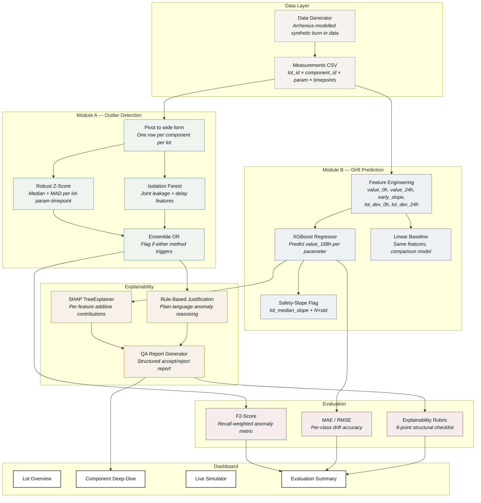

# LATENT

### Cohort-Relative Anomaly Detection & Drift Prediction for Semiconductor Burn-In Screening


> Indian Space Research Organisation (ISRO) · *AI-Driven Anomaly Detection in Component Burn-In & Screening*

**A component reading 45 µA in a lot with a 10 µA median passes every datasheet limit ever written for it. LATENT catches it anyway** — 95.6% recall, only 11 missed defects out of 249, validated end-to-end against 3,559 synthetic components across 10 lots, with the ability to reject a bad component at the 24-hour mark instead of waiting out the full 168-hour burn-in cycle.

This isn't a model bolted onto a demo. It's a complete pipeline — synthetic data grounded in real accelerated-aging physics, two independently-evaluated ML modules, a SHAP-backed explainability layer, and a live dashboard — and every number below is reproducible in under five minutes. See [Quick Start](#-setup-and-quick-start).

## Table of Contents

- [Why This Wins on the Rubric](#-why-this-wins-on-the-rubric)
- [The Problem](#-the-problem)
- [Why Cohort-Relative Screening Wins](#-why-cohort-relative-screening-wins)
- [Architecture](#-architecture)
- [Results at a Glance](#-results-at-a-glance)
- [Demo](#-demo)
- [Real-World Impact](#-real-world-impact)
- [Setup and Quick Start](#-setup-and-quick-start)
- [Project Structure](#-project-structure)
- [Documentation](#-documentation)
- [Team and License](#-team-and-license)

## 🎯 Why This Wins on the Rubric

The problem statement names three specific evaluation criteria. Here's exactly where each is solved, with a measured result attached — not a claim.

| Brief Requirement | Where It's Solved | Measured Result |
|---|---|---|
| **Dynamic outlier detection** — not static pass/fail limits | Module A: robust median/MAD z-score + Isolation Forest ensemble, scored per lot | **F2 = 0.9311**, 95.58% recall, 1.3% false positive rate |
| **Time-series drift predictor** — forecast 168h from 0h/24h only | Module B: XGBoost regressor + safety-slope early-rejection flag | **1.36 µA MAE** (leakage); latent defects flagged **37.4%** of the time from the 24h reading alone |
| **Explainability** — can it justify itself to a QA inspector? | SHAP TreeExplainer + rule-based plain-language QA report generator | **8.0 / 8** average structural rubric score |
| **False negatives are catastrophic** (stated explicitly in the brief) | F2-score used throughout instead of F1 — weights recall 4× over precision | **11 missed defects out of 249**, individually listed, not buried in an aggregate |

## 🧩 The Problem

Semiconductor components undergo burn-in testing — sustained thermal and
electrical stress (typically 125°C for 168 hours) — to precipitate latent
manufacturing defects before field deployment. Parametric measurements
(leakage current, propagation delay) are sampled at intervals (0h, 24h,
96h, 168h) and compared against static datasheet limits.

The limitation of static limits is that they treat every component
identically. A component reading 45 µA in a lot whose median is 10 µA
is exhibiting a 4.5× deviation that strongly indicates a latent defect —
yet it passes a 50 µA datasheet limit. This system replaces static
screening with **cohort-relative** analysis: each component is evaluated
against its manufacturing lot's statistical baseline, not a fixed number.

The system also addresses a second gap: **early rejection**. If a
component's 0h and 24h trajectory already implies dangerous 168h drift,
it can be flagged at 24h — avoiding roughly 85% of the remaining test
duration (`(168h − 24h) ⁄ 168h`) for every component rejected that early.

## ⚡ Why Cohort-Relative Screening Wins

| | Static Datasheet Limits | LATENT (Cohort-Relative) |
|---|---|---|
| Reference point | Fixed absolute value (e.g. 50 µA) | The lot's own statistical baseline (median + MAD) |
| Catches subtle drift under the limit | ❌ No | ✅ Yes — flags a 4.5× deviation even when it's within spec |
| Uses the full trajectory, not just the endpoint | ❌ No | ✅ Yes — Module B predicts 168h from 0h/24h |
| Can reject before the full cycle finishes | ❌ No — waits the full 168h | ✅ Yes — flags at 24h |
| Explains its own decision | ❌ Pass/fail only | ✅ SHAP values + plain-language QA report |

## 🔧 Architecture



## 📊 Results at a Glance

### Anomaly Detection (Module A)

| Metric | Value |
|--------|:-----:|
| **F2-Score** | **0.9311** |
| Recall | 95.58% |
| Precision | 84.40% |
| False Negatives | 11 / 249 defects |
| False Positive Rate | 1.3% |

F2 (not F1) is used because the problem brief states that a false negative
— shipping a defective component — is catastrophic. F2 weights recall 4×
more than precision.

### Drift Prediction (Module B)

| Parameter | XGBoost MAE | Linear MAE | Latent MAE (XGB) |
|-----------|:-----------:|:----------:|:----------------:|
| Leakage Current (µA) | 1.36 | 1.59 | 10.67 |
| Propagation Delay (ns) | 0.42 | 0.50 | 3.19 |

Latent-class MAE is 14× higher than normal-class MAE. This is expected:
the model learns normal drift patterns and cannot predict the unpredictable
divergence of latent defects — the high residual is itself a detection
signal.

### Safety-Slope Early Rejection

| Component Class | Flagged | Flag Rate |
|-----------------|:-------:|:---------:|
| Normal | 2 / 3310 | 0.1% |
| Latent | 74 / 198 | 37.4% |
| Obvious | 32 / 51 | 62.7% |

### Explainability

Average rubric score: **8.0 / 8** (10/10 sampled reports achieved perfect
structural completeness).

## 📸 Demo

| Lot Overview (wafer map) | Component Deep-Dive |
|---|---|
| `docs/screenshots/lot_overview.png` | `docs/screenshots/deep_dive.png` |

| Early-Rejection Simulator | Evaluation Summary |
|---|---|
| `docs/screenshots/simulator.png` | `docs/screenshots/eval_summary.png` |

**Before you submit:** swap each path above for an actual `` image embed once you have screenshots. Even better than static images — a 10–15 second GIF of the Early-Rejection Simulator responding live to typed input, since that's the moment that actually sells the project to someone skimming in 30 seconds.

## 🌍 Real-World Impact

In high-reliability sectors like space, a latent defect that escapes
screening doesn't surface as a warranty claim — it surfaces as a payload
failure, years later, with no way to send a technician. LATENT is designed
as an analysis layer that sits on top of existing ATE (automated test
equipment) pipelines: it doesn't require new test hardware, only smarter
use of the parametric data those systems already collect at every
timepoint. See [`docs/project_report.md`](docs/project_report.md) for a
full discussion of deployment considerations in a real fab/ESS environment.

## 🚀 Setup and Quick Start

### Quick Start

```bash
git clone <https://github.com/Prem-333/Hail-Mary>
python -m venv .venv && source .venv/bin/activate   # Windows: .venv\Scripts\activate
pip install -r requirements.txt
python -m src.data_generation.generate_dataset
streamlit run dashboard/app.py
```

### Prerequisites

- Python 3.11+
- pip

### Full Setup

**1. Clone and create a virtual environment**
```bash
git clone <https://github.com/Prem-333/Hail-Mary>
python -m venv .venv
```

**2. Activate it**
```bash
# Windows:
Set-ExecutionPolicy -ExecutionPolicy RemoteSigned -Scope CurrentUser
.venv\Scripts\activate
# macOS/Linux:
source .venv/bin/activate
```

**3. Install dependencies**
```bash
pip install -r requirements.txt
```

**4. Generate data**
```bash
python -m src.data_generation.generate_dataset
```
Creates `data/generated/burnin_measurements.csv` and
`data/generated/burnin_labels.csv` with ~3,500 components across 10 lots.

**5. Run tests**
```bash
python -m pytest tests/ -v
```
All 36 tests should pass.

**6. Run evaluation**
```bash
python -m src.evaluation.evaluate
```
Outputs `results/metrics.md` with the full metrics breakdown.

**7. Launch the dashboard**
```bash
streamlit run dashboard/app.py
```
Opens at `http://localhost:8501` with four views: Lot Overview, Component
Deep-Dive, Live Early-Rejection Simulator, and Evaluation Summary.

## 📁 Project Structure

```
burnin-screening/
├── dashboard/app.py              # Streamlit dashboard (4 views)
├── data/
│   ├── raw/                      # Placeholder for real fab data
│   └── generated/                # Synthetic burn-in data + trained models
├── src/
│   ├── data_generation/          # Arrhenius-modelled dataset generator
│   ├── outlier_detection/        # Module A: robust z-score + Isolation Forest
│   ├── drift_prediction/         # Module B: XGBoost + linear baseline
│   ├── explainability/           # SHAP + rule-based QA report generator
│   └── evaluation/               # F2-score, MAE/RMSE, explainability rubric
├── tests/                        # 36 unit tests (Module A + B)
├── docs/                         # Rationale, limitations, sample QA report
├── results/metrics.md            # Auto-generated evaluation report
├── requirements.txt
└── README.md
```

## 📚 Documentation

| Doc | What's in it |
|---|---|
| [Project Report](docs/project_report.md) | Full technical write-up |
| [Known Limitations](docs/known_limitations.md) | Honest constraints and what we'd improve with more time |
| [Judge FAQ](docs/judge_faq.md) | Answers to the questions most likely to come up |
| [Sample QA Report](docs/sample_qa_report.md) | A real flagged latent defect, explained plainly |
| [Data Generation Rationale](docs/data_generation_rationale.md) | The physics behind the synthetic data model |

## 👥 Team and License

**Team Name:** Hail Mary
**Members:** _add team member names here_

**License:** MIT

---

*Built for Smart India Hackathon 2026.*
